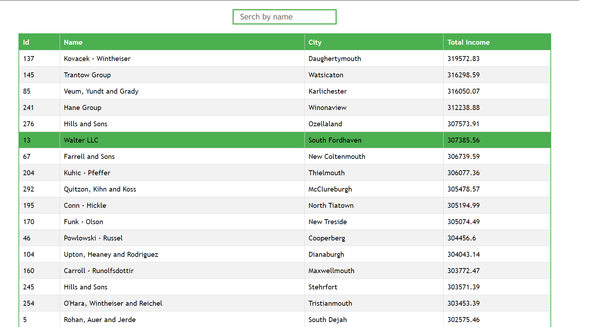
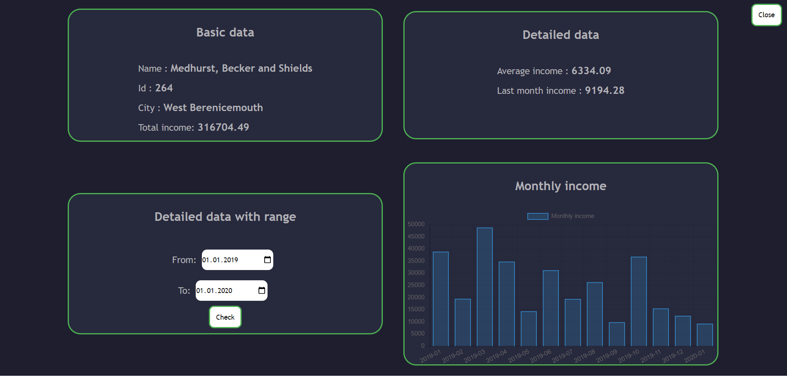

# Incomes-Companies

A Incomes-Companies is an application built with Vanilla.js which displays companies' revenues from the database and enables their detailed analysis. After starting the application, you must wait a few moments for the data from the server to be downloaded and correctly displayed. This may take up to a minute. Above the table is the input where you can search for company by its name. After clicking the ID of the company we are interested in you will be redirected to the detailed view.



In the detailed view you can choose the range for which you want to calculate total and average income, just select two dates and click check.
After clicking the "close" button you will be redirected to the table view with companies. This button should be in the upper right corner.



## Getting Started

To download the project, download it to your computer. Then follow the instructions.

### Installing

To initiate the project, enter in the terminal:

```
npm install
```

To start a live server, enter in the terminal:

```
npm  start
```

To create a distribution version, type in terminal:

```
npm run build
```

## Features

- Input that filters the result of the table by name
- After selecting a company, user will be redirected to the company details view
- Table is paginated
- The detailed view contains a lot of useful company data
- RWD

## Built With

- HTML
- CSS
- JavaScript
- GIT
- Parcel

## Author

- **Jarkowski Tomasz**

## License

For personal use only. Do not distribute.
